# 🚀 NUVEX CARDANO - Advanced Cross-Chain Atomic Swap Infrastructure

> **Complete bidirectional atomic swap system between Cardano and Ethereum with 1inch Protocol integration, MEV protection, and advanced DeFi capabilities.**

## 📺 **Demo Video**

https://github.com/user-attachments/assets/6d791ecd-8aec-4750-8e8c-4aaef0f49bac

*Fully functional atomic swaps demonstration*

---

## 🏗️ **Project Architecture Overview**

This repository contains a complete ecosystem for cross-chain atomic swaps with multiple implementation approaches and advanced features.


---

## � **Cross-Chain Escrow Integration**

### **How Solidity Escrow Connects with Cardano**

The project implements sophisticated cross-chain escrow mechanisms using Hash Time Locked Contracts (HTLCs) and 1inch protocol integration.

```mermaid
graph LR
    subgraph "⛓️ Ethereum"
        ETH[AtomicSwap1inch.sol<br/>� Lock ETH<br/>🌟 1inch Integration]
    end
    
    subgraph "🌉 Bridge"
        SECRET[🔐 Secret Hash<br/>⏰ Timelock<br/>📡 Events]
    end
    
    subgraph "🏛️ Cardano"
        ADA[escrow.ak<br/>� Lock ADA<br/>🏗️ UTXO Logic]
    end
    
    subgraph "☁️ Demeter.run"
        DEMETER[🖥️ Cardano Node<br/>🔧 VS Code<br/>📊 Blockfrost]
    end
    
    ETH <--> SECRET
    SECRET <--> ADA
    ADA <--> DEMETER
    
    ETH -.->|"1. Create Swap"| SECRET
    ADA -.->|"2. Lock Response"| SECRET
    SECRET -.->|"3. Reveal Secret"| ETH
    SECRET -.->|"4. Claim with Secret"| ADA
```



### **Timelock and Hashlock Mechanics**

```mermaid
graph LR
    subgraph "🔐 Hashlock Mechanism"
        SECRET[Secret (32 bytes)<br/>Random preimage]
        HASH_ETH[ETH Hash<br/>keccak256(secret)]
        HASH_ADA[ADA Hash<br/>sha256(secret)]
        
        SECRET --> HASH_ETH
        SECRET --> HASH_ADA
    end
    
    subgraph "⏰ Timelock Mechanism"
        T0[T0: Swap Creation<br/>Both chains initialized]
        T1[T1: Lock Phase<br/>Funds locked on both sides]
        T2[T2: Reveal Phase<br/>Secret revealed on one chain]
        T3[T3: Claim Phase<br/>Secret used on other chain]
        T4[T4: Timeout<br/>Refund if not completed]
        
        T0 --> T1
        T1 --> T2
        T2 --> T3
        T1 -.-> T4
        T2 -.-> T4
    end
    
    subgraph "🔄 Cross-Chain Coordination"
        ETH_LOCK[ETH Locked<br/>With hashlock + timelock]
        ADA_LOCK[ADA Locked<br/>With same hash + timelock]
        SECRET_REVEAL[Secret Revealed<br/>On claiming chain]
        CROSS_CLAIM[Cross-chain Claim<br/>Using revealed secret]
        
        ETH_LOCK --> SECRET_REVEAL
        ADA_LOCK --> SECRET_REVEAL
        SECRET_REVEAL --> CROSS_CLAIM
    end

    classDef hashStyle fill:#e3f2fd,stroke:#1976d2,stroke-width:2px
    classDef timeStyle fill:#fff3e0,stroke:#f57c00,stroke-width:2px
    classDef coordStyle fill:#e8f5e8,stroke:#2e7d32,stroke-width:2px
    
    class SECRET,HASH_ETH,HASH_ADA hashStyle
    class T0,T1,T2,T3,T4 timeStyle
    class ETH_LOCK,ADA_LOCK,SECRET_REVEAL,CROSS_CLAIM coordStyle
```

---

## 💻 **Solidity Code Integration with 1inch**

### **AtomicSwap1inch.sol - Core Implementation**

```mermaid
graph TB
    subgraph "📝 Contract Structure & Extensions"
        CONTRACT[AtomicSwap1inch.sol]
        
        subgraph "🛡️ OpenZeppelin Extensions"
            REENTRANCY[ReentrancyGuard<br/>import "@openzeppelin/contracts/security/ReentrancyGuard.sol"]
            OWNABLE[Ownable<br/>import "@openzeppelin/contracts/access/Ownable.sol"]
            IERC20[IERC20<br/>import "@openzeppelin/contracts/token/ERC20/IERC20.sol"]
            SAFEERC20[SafeERC20<br/>import "@openzeppelin/contracts/token/ERC20/utils/SafeERC20.sol"]
        end
        
        subgraph "🌟 1inch Protocol Interfaces"
            ROUTER_INTERFACE[IAggregationRouterV5<br/>Main 1inch router interface]
            ORDER_INTERFACE[IOrderMixin<br/>Order management interface]
            SWAP_DESC[SwapDescription<br/>Swap parameters struct]
            ORDER_STRUCT[Order<br/>1inch order structure]
        end
        
        subgraph "🏗️ Core Data Structures"
            ATOMIC_DATA[AtomicSwapData<br/>Complete swap state]
            MEV_PROTECTION[MevProtection<br/>Anti-MEV parameters]
            SWAP_STATUS[SwapStatus enum<br/>State management]
        end
        
        subgraph "⚡ Key Functions"
            CREATE_FUNC[createSwap()<br/>Initialize with MEV protection]
            CLAIM_FUNC[claimWithOneInch()<br/>Execute with 1inch optimization]
            REFUND_FUNC[refund()<br/>Timeout recovery]
            EXECUTE_1INCH[_executeOneInchSwap()<br/>Internal 1inch integration]
        end
    end
    
    CONTRACT --> REENTRANCY
    CONTRACT --> OWNABLE
    CONTRACT --> IERC20
    CONTRACT --> SAFEERC20
    
    CONTRACT --> ROUTER_INTERFACE
    CONTRACT --> ORDER_INTERFACE
    CONTRACT --> SWAP_DESC
    CONTRACT --> ORDER_STRUCT
    
    CONTRACT --> ATOMIC_DATA
    CONTRACT --> MEV_PROTECTION
    CONTRACT --> SWAP_STATUS
    
    CREATE_FUNC --> MEV_PROTECTION
    CLAIM_FUNC --> EXECUTE_1INCH
    EXECUTE_1INCH --> ROUTER_INTERFACE

    classDef contractStyle fill:#e3f2fd,stroke:#1976d2,stroke-width:3px
    classDef ozStyle fill:#e8f5e8,stroke:#2e7d32,stroke-width:2px
    classDef oneinchStyle fill:#fff3e0,stroke:#f57c00,stroke-width:2px
    classDef dataStyle fill:#f3e5f5,stroke:#7b1fa2,stroke-width:2px
    classDef functionStyle fill:#ffebee,stroke:#c62828,stroke-width:2px
    
    class CONTRACT contractStyle
    class REENTRANCY,OWNABLE,IERC20,SAFEERC20 ozStyle
    class ROUTER_INTERFACE,ORDER_INTERFACE,SWAP_DESC,ORDER_STRUCT oneinchStyle
    class ATOMIC_DATA,MEV_PROTECTION,SWAP_STATUS dataStyle
    class CREATE_FUNC,CLAIM_FUNC,REFUND_FUNC,EXECUTE_1INCH functionStyle
```

### **1inch Integration Code Flow**


### **Extension Usage in Code**

```solidity
// File: AtomicSwap1inch.sol
// SPDX-License-Identifier: MIT
pragma solidity ^0.8.19;

// 🛡️ OpenZeppelin Security Extensions
import "@openzeppelin/contracts/security/ReentrancyGuard.sol";
import "@openzeppelin/contracts/access/Ownable.sol";
import "@openzeppelin/contracts/token/ERC20/IERC20.sol";
import "@openzeppelin/contracts/token/ERC20/utils/SafeERC20.sol";

contract AtomicSwap1inch is ReentrancyGuard, Ownable {
    using SafeERC20 for IERC20;

    // 🌟 1inch Protocol Integration
    address public constant ONEINCH_ROUTER_V5 = 0x111111125421cA6dc452d289314280a0f8842A65;
    
    // 🔐 Hashlock Implementation
    mapping(bytes32 => AtomicSwapData) public swaps;
    
    // ⏰ Timelock with MEV Protection
    struct MevProtection {
        uint256 maxSlippageBps;     // 0.5% maximum slippage
        uint256 minGasPrice;        // 10 gwei minimum  
        uint256 maxGasPrice;        // 100 gwei maximum
        uint256 deadlineBuffer;     // 5 minutes buffer
    }
    
    // 🔄 Cross-chain Coordination
    struct AtomicSwapData {
        bytes32 secretHash;         // keccak256(secret) for Ethereum
        bytes32 cardanoTxHash;      // Cardano transaction coordination
        uint256 deadline;           // Unix timestamp timelock
        // ... other fields
    }
    
    // 🌟 1inch Integration Function
    function _executeOneInchSwap(
        AtomicSwapData memory swap,
        bytes calldata oneinchCalldata
    ) internal returns (uint256 returnAmount, uint256 spentAmount) {
        // Approve 1inch router
        if (swap.token != address(0)) {
            IERC20(swap.token).safeApprove(ONEINCH_ROUTER_V5, swap.amount);
        }
        
        // Execute 1inch aggregation
        (bool success, bytes memory result) = ONEINCH_ROUTER_V5.call{
            value: swap.token == address(0) ? swap.amount : 0
        }(oneinchCalldata);
        
        require(success, "1inch swap failed");
        // Verify minimum return for slippage protection
        require(returnAmount >= swap.oneinchMinReturn, "Insufficient return");
    }
}
```

---

## 🏛️ **Cardano Integration Architecture**

### **Aiken Validator Connection with Ethereum**

```mermaid
graph TB
    subgraph "🏗️ Cardano Smart Contract Layer"
        subgraph "⚡ Aiken Validators"
            ESCROW_AK[escrow.ak<br/>Main validator logic]
            REVERSE_AK[reverse_validator.ak<br/>Reverse flow handler]
            ATOMIC_AK[atomic_swap.ak<br/>Cross-chain coordinator]
        end
        
        subgraph "📜 Haskell Contracts"
            ATOMIC_HS[AtomicSwap.hs<br/>Plutus contract logic]
            ONEINCH_HS[OneInchIntegration.hs<br/>Cross-chain coordination]
        end
        
        subgraph "🔐 Hash & Time Logic"
            HASH_VALIDATION[Hash Validation<br/>sha256(secret) verification]
            TIMELOCK_VALIDATION[Timelock Validation<br/>Deadline checking]
            UTXO_MANAGEMENT[UTXO Management<br/>Datum/Redeemer logic]
        end
    end
    
    subgraph "🌉 Cross-Chain Bridge Logic"
        SECRET_COORDINATION[Secret Coordination<br/>Shared hash across chains]
        TIME_COORDINATION[Time Coordination<br/>Synchronized deadlines]
        EVENT_COORDINATION[Event Coordination<br/>Status synchronization]
    end
    
    subgraph "⛓️ Ethereum Integration Points"
        ETH_EVENTS[Ethereum Events<br/>SwapCreated, SwapClaimed]
        ORACLE_BRIDGE[Oracle Bridge<br/>Cross-chain communication]
        STATUS_SYNC[Status Synchronization<br/>Real-time updates]
    end
    
    subgraph "🔧 Development Tools"
        MESH_SDK[MeshSDK<br/>Transaction building]
        BLOCKFROST_API[Blockfrost API<br/>Chain queries]
        AIKEN_CLI[Aiken CLI<br/>Validator compilation]
    end
    
    %% Aiken connections
    ESCROW_AK --> HASH_VALIDATION
    REVERSE_AK --> TIMELOCK_VALIDATION
    ATOMIC_AK --> UTXO_MANAGEMENT
    
    %% Haskell connections
    ATOMIC_HS --> SECRET_COORDINATION
    ONEINCH_HS --> TIME_COORDINATION
    
    %% Cross-chain coordination
    SECRET_COORDINATION --> ETH_EVENTS
    TIME_COORDINATION --> ORACLE_BRIDGE
    EVENT_COORDINATION --> STATUS_SYNC
    
    %% Tool integrations
    UTXO_MANAGEMENT --> MESH_SDK
    HASH_VALIDATION --> BLOCKFROST_API
    ESCROW_AK --> AIKEN_CLI

    classDef aikenStyle fill:#e3f2fd,stroke:#1976d2,stroke-width:3px
    classDef haskellStyle fill:#f3e5f5,stroke:#7b1fa2,stroke-width:2px
    classDef validationStyle fill:#e8f5e8,stroke:#2e7d32,stroke-width:2px
    classDef bridgeStyle fill:#fff3e0,stroke:#f57c00,stroke-width:3px
    classDef ethereumStyle fill:#ffebee,stroke:#c62828,stroke-width:2px
    classDef toolStyle fill:#e0f2f1,stroke:#00695c,stroke-width:2px
    
    class ESCROW_AK,REVERSE_AK,ATOMIC_AK aikenStyle
    class ATOMIC_HS,ONEINCH_HS haskellStyle
    class HASH_VALIDATION,TIMELOCK_VALIDATION,UTXO_MANAGEMENT validationStyle
    class SECRET_COORDINATION,TIME_COORDINATION,EVENT_COORDINATION bridgeStyle
    class ETH_EVENTS,ORACLE_BRIDGE,STATUS_SYNC ethereumStyle
    class MESH_SDK,BLOCKFROST_API,AIKEN_CLI toolStyle
```

### **Demeter.run Cloud Infrastructure Integration**


---

## 🔄 **Simple Swap Flows**

### **ETH → ADA Swap**

```mermaid
sequenceDiagram
    participant Alice as 👩 Alice
    participant ETH as 🔷 Ethereum
    participant ADA as 🔸 Cardano
    participant Bob as 👨 Bob

    Alice->>ETH: 1. Lock ETH + secret hash
    ETH->>ADA: 2. Send lock event
    Bob->>ADA: 3. Lock ADA (same hash)
    Alice->>ADA: 4. Claim ADA + reveal secret
    Bob->>ETH: 5. Claim ETH with secret
    Note over Alice,Bob: ✅ Swap Complete
```



### **ADA → ETH Swap**

```mermaid
sequenceDiagram
    participant Bob as 👨 Bob
    participant ADA as 🔸 Cardano
    participant ETH as 🔷 Ethereum
    participant Alice as 👩 Alice

    Bob->>ADA: 1. Lock ADA + secret hash
    ADA->>ETH: 2. Send lock event
    Alice->>ETH: 3. Lock ETH (same hash)
    Bob->>ETH: 4. Claim ETH + reveal secret
    Alice->>ADA: 5. Claim ADA with secret
    Note over Bob,Alice: ✅ Swap Complete
```



---

## 🌐 **Demeter.run Integration Links**

### **Quick Access Links**

- 🏠 **Demeter.run Platform**: [https://demeter.run](https://demeter.run)
- 📚 **Demeter Documentation**: [https://docs.demeter.run](https://docs.demeter.run)
- 🎯 **Project Setup Guide**: [`demeter-atomic-swap/README.md`](./demeter-atomic-swap/README.md)
- ⚙️ **Configuration Templates**: [`demeter-atomic-swap/config/`](./demeter-atomic-swap/config/)

### **Demeter.run Workspace Setup**

```bash
# 1. Create Demeter.run workspace
# Visit: https://demeter.run/new-workspace

# 2. Select Extensions:
# ✅ Cardano Node (Preprod/Mainnet)
# ✅ Blockfrost API 
# ✅ VS Code IDE
# ✅ Aiken Language Server

# 3. Clone project in Demeter workspace
git clone https://github.com/SHLOK333/nuvex-cardano.git
cd nuvex-cardano/demeter-atomic-swap

# 4. Run setup script
./scripts/setup-demeter.sh

# 5. Deploy contracts
./scripts/deploy-contracts.sh preprod
```

---

## 🌲 **Project Structure**

### **Simple Project Overview**

```mermaid
graph TB
    MAIN[🏠 Main Project]
    
    MAIN --> ADA[🔸 ada-eth-atomic-swap<br/>Basic Swaps]
    MAIN --> DEMETER[☁️ demeter-atomic-swap<br/>Cloud + 1inch]
    MAIN --> CARDANO[🏛️ cardano/<br/>Aiken Validators]
    MAIN --> ETHEREUM[⛓️ ethereum/<br/>Solidity Contracts]
    
    ADA --> |Basic| SWAP1[Standard HTLCs]
    DEMETER --> |Advanced| SWAP2[1inch + MEV Protection]
    CARDANO --> |Validators| VALID[escrow.ak]
    ETHEREUM --> |Contracts| CONTRACT[AtomicSwap1inch.sol]
```



### **Extension Integration Architecture**

```mermaid
graph TB
    subgraph "🛡️ Security"
        SECURITY[ReentrancyGuard<br/>Ownable<br/>Pausable]
    end
    
    subgraph "💰 Tokens"
        TOKENS[IERC20<br/>SafeERC20<br/>ERC20Permit]
    end
    
    subgraph "🌟 1inch"
        ONEINCH[AggregationRouter<br/>OrderMixin<br/>LimitOrders]
    end
    
    subgraph "�️ Cardano"
        CARDANO[Aiken Stdlib<br/>PlutusTx<br/>MeshSDK]
    end
    
    subgraph "⚡ Contract"
        CONTRACT[AtomicSwap1inch.sol<br/>escrow.ak]
    end
    
    SECURITY --> CONTRACT
    TOKENS --> CONTRACT
    ONEINCH --> CONTRACT
    CARDANO --> CONTRACT
```



### **How Extensions Work Together**

```mermaid
flowchart LR
    A[📥 Import] --> B[🏗️ Initialize]
    B --> C[⚡ Execute]
    C --> D[🔄 Integrate]
    
    A -.-> |Libraries| E[OpenZeppelin<br/>1inch<br/>Aiken]
    B -.-> |Setup| F[Security<br/>Tokens<br/>DeFi]
    C -.-> |Runtime| G[Functions<br/>Modifiers<br/>Events]
    D -.-> |Cross-chain| H[Ethereum<br/>Cardano<br/>Bridge]
```



### **1. Standard Atomic Swap Implementation (`ada-eth-atomic-swap/`)**

#### **Simple Swap Process**

```mermaid
graph TD
    A[👩 Alice: Generate Secret] --> B[🔷 Lock ETH with Hash]
    B --> C[🔸 Bob: Lock ADA with Same Hash]
    C --> D[👩 Alice: Claim ADA + Reveal Secret]
    D --> E[👨 Bob: Claim ETH with Secret]
    E --> F[✅ Swap Complete]
```



---

### **2. 1inch Integration Deep Dive**

#### **AtomicSwap1inch.sol Contract Analysis**

The contract implements advanced features with 1inch protocol integration:

```mermaid
graph TB
    subgraph "🎯 AtomicSwap1inch Contract Structure"
        MAIN_CONTRACT[AtomicSwap1inch.sol<br/>Main Contract]
        
        subgraph "📝 Core Interfaces"
            ROUTER_INTERFACE[IAggregationRouterV5<br/>1inch Router Interface]
            ORDER_INTERFACE[IOrderMixin<br/>Order Management]
        end
        
        subgraph "🏗️ Data Structures"
            SWAP_DATA[AtomicSwapData<br/>Complete swap information]
            MEV_PROTECTION[MevProtection<br/>Anti-MEV parameters]
            ORDER_STRUCT[Order<br/>1inch order structure]
        end
        
        subgraph "⚡ Core Functions"
            CREATE_SWAP[createSwap()<br/>Initialize atomic swap]
            CLAIM_1INCH[claimWithOneInch()<br/>Claim with 1inch execution]
            REFUND[refund()<br/>Timeout refund]
            EXECUTE_SWAP[_executeOneInchSwap()<br/>Internal 1inch integration]
        end
        
        subgraph "🛡️ Security Features"
            REENTRANCY[ReentrancyGuard<br/>Reentrancy protection]
            OWNERSHIP[Ownable<br/>Access control]
            MEV_VALIDATION[_validateMevProtection()<br/>MEV protection]
        end
    end

    MAIN_CONTRACT --> ROUTER_INTERFACE
    MAIN_CONTRACT --> ORDER_INTERFACE
    MAIN_CONTRACT --> SWAP_DATA
    MAIN_CONTRACT --> MEV_PROTECTION
    MAIN_CONTRACT --> ORDER_STRUCT
    
    CREATE_SWAP --> MEV_VALIDATION
    CLAIM_1INCH --> EXECUTE_SWAP
    EXECUTE_SWAP --> ROUTER_INTERFACE
    
    MAIN_CONTRACT --> REENTRANCY
    MAIN_CONTRACT --> OWNERSHIP

    classDef contractStyle fill:#e8f5e8,stroke:#2e7d32,stroke-width:3px
    classDef interfaceStyle fill:#fff3e0,stroke:#f57c00,stroke-width:2px
    classDef dataStyle fill:#e3f2fd,stroke:#1976d2,stroke-width:2px
    classDef functionStyle fill:#f3e5f5,stroke:#7b1fa2,stroke-width:2px
    classDef securityStyle fill:#ffebee,stroke:#c62828,stroke-width:2px
    
    class MAIN_CONTRACT contractStyle
    class ROUTER_INTERFACE,ORDER_INTERFACE interfaceStyle
    class SWAP_DATA,MEV_PROTECTION,ORDER_STRUCT dataStyle
    class CREATE_SWAP,CLAIM_1INCH,REFUND,EXECUTE_SWAP functionStyle
    class REENTRANCY,OWNERSHIP,MEV_VALIDATION securityStyle
```

#### **1inch Integration Points**

```solidity
// 1inch Protocol Integration Points in AtomicSwap1inch.sol

// 1. Router Interface Integration
interface IAggregationRouterV5 {
    function swap(
        address executor,
        SwapDescription calldata desc,
        bytes calldata permit,
        bytes calldata data
    ) external payable returns (uint256 returnAmount, uint256 spentAmount);
}

// 2. Advanced Swap Execution
function _executeOneInchSwap(
    AtomicSwapData memory swap,
    bytes calldata oneinchCalldata
) internal returns (uint256 returnAmount, uint256 spentAmount) {
    // Token approval for 1inch router
    if (swap.token != address(0)) {
        IERC20(swap.token).safeApprove(ONEINCH_ROUTER_V5, swap.amount);
    }
    
    // Execute optimal swap through 1inch aggregation
    (bool success, bytes memory result) = ONEINCH_ROUTER_V5.call{
        value: swap.token == address(0) ? swap.amount : 0
    }(oneinchCalldata);
    
    // Verify minimum return and slippage protection
    require(returnAmount >= swap.oneinchMinReturn, "Insufficient return");
}

// 3. MEV Protection Integration
struct MevProtection {
    uint256 maxSlippageBps;     // 0.5% maximum slippage
    uint256 minGasPrice;        // 10 gwei minimum
    uint256 maxGasPrice;        // 100 gwei maximum  
    uint256 deadlineBuffer;     // 5 minutes buffer
}
```

---

### **3. Advanced Features & Extensions**

#### **Partial Filling Implementation**


#### **MEV Protection Mechanisms**


---

### **4. Smart Contract Escrow System**

#### **Escrow Flow Architecture**


#### **Escrow Security Features**


---

### **5. Extensions & Integrations Used**

#### **OpenZeppelin Extensions**


#### **1inch Protocol Extensions**

```mermaid
graph TB
    subgraph "🌟 1inch Protocol Integration"
        ONEINCH[1inch Aggregation Protocol]
        
        subgraph "🔧 Router Components"
            ROUTER_V5[AggregationRouterV5<br/>Main swap router]
            ORDER_MIXIN[OrderMixin<br/>Order management]
            LIMIT_ORDER[LimitOrderProtocol<br/>Advanced orders]
        end
        
        subgraph "💡 Smart Features"
            PATHFINDER[Pathfinder<br/>Optimal route discovery]
            CHI_TOKEN[CHI Token<br/>Gas optimization]
            PRICE_ORACLE[Price Oracle<br/>Fair price discovery]
        end
        
        subgraph "🎯 Optimization Features"
            GAS_OPTIMIZATION[Gas Optimization<br/>Minimal gas usage]
            PARTIAL_FILL[Partial Fill<br/>Large order splitting]
            MEV_PROTECTION[MEV Protection<br/>Front-run defense]
        end
    end
    
    ONEINCH --> ROUTER_V5
    ONEINCH --> ORDER_MIXIN
    ONEINCH --> LIMIT_ORDER
    
    ROUTER_V5 --> PATHFINDER
    ROUTER_V5 --> CHI_TOKEN
    ROUTER_V5 --> PRICE_ORACLE
    
    ORDER_MIXIN --> GAS_OPTIMIZATION
    ORDER_MIXIN --> PARTIAL_FILL
    ORDER_MIXIN --> MEV_PROTECTION

    classDef oneinchStyle fill:#fff3e0,stroke:#f57c00,stroke-width:3px
    classDef routerStyle fill:#e8f5e8,stroke:#2e7d32,stroke-width:2px
    classDef featureStyle fill:#f3e5f5,stroke:#7b1fa2,stroke-width:2px
    classDef optimizationStyle fill:#e3f2fd,stroke:#1976d2,stroke-width:2px
    
    class ONEINCH oneinchStyle
    class ROUTER_V5,ORDER_MIXIN,LIMIT_ORDER routerStyle
    class PATHFINDER,CHI_TOKEN,PRICE_ORACLE featureStyle
    class GAS_OPTIMIZATION,PARTIAL_FILL,MEV_PROTECTION optimizationStyle
```



---

## 🔍 **Detailed Contract Analysis**

### **AtomicSwap1inch.sol - Core Functions**

#### **1. createSwap() Function**

```solidity
function createSwap(
    bytes32 secretHash,      // keccak256(secret) - 32 byte hash
    address beneficiary,     // Who can claim with secret
    uint256 deadline,        // Unix timestamp deadline
    address token,           // Token address (0x0 for ETH)
    bytes32 cardanoTxHash,   // Cardano tx for coordination
    uint256 oneinchMinReturn // Minimum 1inch return amount
) external payable nonReentrant
```

**Features:**

- ✅ **Unique Swap ID Generation**: `keccak256(sender + beneficiary + secretHash + deadline + nonce + timestamp)`
- ✅ **MEV Protection Validation**: Gas price limits, deadline buffer validation
- ✅ **Multi-token Support**: ETH and ERC20 tokens
- ✅ **Cross-chain Coordination**: Cardano transaction hash linking

#### **2. claimWithOneInch() Function**

```solidity
function claimWithOneInch(
    bytes32 swapId,              // Unique swap identifier
    bytes32 secret,              // 32-byte secret preimage
    bytes calldata oneinchCalldata // 1inch router calldata
) external nonReentrant
```

**Features:**

- ✅ **Secret Verification**: `keccak256(secret) == storedHash`
- ✅ **Deadline Validation**: Block timestamp checking
- ✅ **Beneficiary Authorization**: Only designated claimer
- ✅ **1inch Integration**: Optimal liquidity routing
- ✅ **Slippage Protection**: Minimum return validation

#### **3. Partial Fill Implementation**

```solidity
// Enhanced structure for partial fills
struct PartialSwapData {
    bytes32 parentSwapId;        // Original large order ID
    uint256 totalAmount;         // Total order amount
    uint256 filledAmount;        // Amount already filled
    uint256 remainingAmount;     // Amount left to fill
    uint256 minFillAmount;       // Minimum fill size
    bool allowPartialFill;       // Enable partial execution
}

// Partial fill execution
function executePartialFill(
    bytes32 swapId,
    uint256 fillAmount,
    bytes calldata oneinchCalldata
) external nonReentrant {
    // Validate fill amount constraints
    // Execute 1inch swap for partial amount
    // Update fill tracking state
    // Emit partial fill events
}
```

---

## 📦 **Project Structure**

```text
nuvex-cardano/
├── 📖 README.md                           # This comprehensive guide
├── 🎥 demo-video/                         # Demonstration materials
├── 📊 docs/                               # Additional documentation
│
├── 🔄 ada-eth-atomic-swap/               # Standard atomic swap implementation
│   ├── 📄 README.md                      # Implementation guide
│   ├── 🏗️ cardano/                      # Cardano-side implementation
│   │   ├── reverse_common.js             # Common utilities
│   │   ├── reverse_lock.js               # ADA locking logic
│   │   ├── reverse_unlock.js             # ADA unlocking logic
│   │   └── escrow/                       # Smart contract validators
│   │       ├── reverse_validator.ak      # Aiken validator
│   │       └── reverse_plutus.json       # Compiled Plutus script
│   └── ⛓️ ethereum/                     # Ethereum-side implementation
│       ├── script/                       # Foundry deployment scripts
│       └── src/                          # Smart contracts
│           └── ReverseEscrow.sol         # Ethereum escrow contract
│
├── ☁️ demeter-atomic-swap/              # Demeter.run cloud infrastructure
│   ├── 📊 README.md                     # Detailed architecture guide
│   ├── 🏗️ cardano-haskell/             # Plutus smart contracts
│   │   ├── AtomicSwap.hs                # Main Haskell contract
│   │   └── OneInchIntegration.hs        # 1inch coordination
│   ├── ⚡ cardano-aiken/                # High-performance validators
│   │   └── validators/atomic_swap.ak    # Optimized Aiken validator
│   ├── ⛓️ ethereum-1inch/              # Advanced Ethereum integration
│   │   ├── src/AtomicSwap1inch.sol      # Main contract with 1inch
│   │   └── foundry.toml                 # Foundry configuration
│   ├── ⚙️ config/                       # Network configurations
│   │   ├── preprod.template.json        # Preprod network template
│   │   └── mainnet.template.json        # Mainnet network template
│   └── 🤖 scripts/                      # Automation scripts
│       ├── setup-demeter.sh             # Environment setup
│       ├── deploy-contracts.sh          # Contract deployment
│       └── run-atomic-swap.sh           # Swap execution
│
├── 🔗 cardano/                          # Core Cardano integration
│   ├── 🔑 beneficiary.addr              # Test addresses
│   ├── 🔑 owner.addr                    # Owner addresses
│   ├── 📜 common.js                     # Shared utilities
│   ├── 🔒 lock.js                       # Locking mechanisms
│   ├── 🔓 unlock.js                     # Unlocking mechanisms
│   ├── 🏗️ generate-credentials.js       # Key generation
│   ├── 📦 package.json                  # Node.js dependencies
│   └── 🏛️ escrow/                      # Cardano smart contracts
│       ├── aiken.toml                   # Aiken configuration
│       ├── plutus.json                  # Compiled Plutus scripts
│       └── validators/escrow.ak         # Main escrow validator
│
├── ⛓️ ethereum/                         # Core Ethereum integration
│   ├── 🔧 foundry.toml                  # Foundry configuration
│   ├── 📊 broadcast/                    # Deployment logs
│   ├── 💾 cache/                        # Compilation cache
│   ├── 📚 lib/forge-std/                # Foundry standard library
│   ├── 📜 script/                       # Deployment scripts
│   │   ├── Deploy.sol                   # Standard deployment
│   │   ├── Withdraw.sol                 # Withdrawal script
│   │   ├── TimelockDeploy.sol          # Timelock deployment
│   │   └── TimelockWithdraw.sol        # Timelock withdrawal
│   └── 🏗️ src/                         # Smart contracts
│       └── EscrowSrc.sol                # Core escrow contract
│
└── 🔐 secrets/                          # Security configurations
    ├── blockfrost-api-key.age           # Encrypted API keys
    ├── ethereum-wallet-private-key.age  # Encrypted private keys
    └── secrets.nix                      # Nix secrets configuration
```

---

## 🚀 **Getting Started**

### **Quick Start Guide**

1. **Choose Your Implementation:**
   - 🔄 `ada-eth-atomic-swap/` - Standard implementation
   - ☁️ `demeter-atomic-swap/` - Cloud infrastructure

2. **Set Up Environment:**
   ```bash
   # Clone repository
   git clone https://github.com/SHLOK333/nuvex-cardano.git
   cd nuvex-cardano
   
   # Choose implementation
   cd demeter-atomic-swap  # or ada-eth-atomic-swap
   
   # Install dependencies
   ./scripts/setup-demeter.sh
   ```

3. **Configure Networks:**
   ```bash
   # Copy template configurations
   cp config/preprod.template.json config/preprod.json
   cp config/mainnet.template.json config/mainnet.json
   
   # Add your API keys and configuration
   nano config/preprod.json
   ```

4. **Deploy Contracts:**
   ```bash
   # Deploy to testnet
   ./scripts/deploy-contracts.sh preprod
   
   # Deploy to mainnet (when ready)
   ./scripts/deploy-contracts.sh mainnet
   ```

5. **Execute Atomic Swap:**
   ```bash
   # Run bidirectional swap
   ./scripts/run-atomic-swap.sh preprod
   ```

---

## 🔗 **Live Deployments**

### **Testnet Deployments (Sepolia)**

| Contract | Address | Transaction Hash |
|----------|---------|------------------|
| **EscrowSrc** | `0x7221d00404Ac3EdcD38BcfAEd261b41b676721C9` | [0x693c3ef7bc1b6f0e1ba4648460f42d032d383984d72fc8c646b644087b6dc066](https://sepolia.etherscan.io/tx/0x693c3ef7bc1b6f0e1ba4648460f42d032d383984d72fc8c646b644087b6dc066) |
| **AtomicSwap1inch** | `0x35f0289a16f9427A8f2EDdFf3151Dc088873129c` | [0x06652668660c9059a4a33f188459bf1cfcfa874a784f3270b9dbb918bb0dff65](https://sepolia.etherscan.io/tx/0x06652668660c9059a4a33f188459bf1cfcfa874a784f3270b9dbb918bb0dff65) |
| **Latest Deploy** | `0x0C47546DC870782DDD8A86E0FEb12995523E380d` | [0xb1be12ddee19b3b0c6c6d2fa556a454e9441c945bcaca4ee2252147a34f0983f](https://sepolia.etherscan.io/tx/0xb1be12ddee19b3b0c6c6d2fa556a454e9441c945bcaca4ee2252147a34f0983f) |

### **Cardano Testnet (Preprod)**

| Component | Address/Hash | Explorer Link |
|-----------|--------------|---------------|
| **Test Wallet** | `addr_test1vqp9zy2cct39sh2w6zy4ylyns7jgfkcev7mrtwtfxzg8qgshda3cx` | [Preprod Explorer](https://preprod.cardanoscan.io/address/addr_test1vqp9zy2cct39sh2w6zy4ylyns7jgfkcev7mrtwtfxzg8qgshda3cx) |
| **Generated Wallet** | `addr_test1qrpf2jzqg6wx6rehasphfkfagw0aeqze3km9pzn66kpgv4pwchump6eh3ymzhekjzcsr8khy0faha7m2uhq94wuepkfsu428xe` | [Preprod Explorer](https://preprod.cardanoscan.io/address/addr_test1qrpf2jzqg6wx6rehasphfkfagw0aeqze3km9pzn66kpgv4pwchump6eh3ymzhekjzcsr8khy0faha7m2uhq94wuepkfsu428xe) |
| **Test Transaction** | `2e6ca7b8c9b2184937a52a44f1959a29bf9d0ca75460cb0f5f987d9f6ad50afd` | [Transaction Details](https://preprod.cardanoscan.io/transaction/2e6ca7b8c9b2184937a52a44f1959a29bf9d0ca75460cb0f5f987d9f6ad50afd) |
| **Latest Lock TX** | `f833839c9692d0bff756311b09bed5dc76f06b5da808df91b2755220e4dcd1fc` | [Transaction Details](https://preprod.cardanoscan.io/transaction/f833839c9692d0bff756311b09bed5dc76f06b5da808df91b2755220e4dcd1fc) |

---

## 🎯 **Key Features Summary**

### **✅ Implemented Features**

- 🔄 **Bidirectional Atomic Swaps** (ETH ↔ ADA)
- 🌟 **1inch Protocol Integration** for optimal liquidity
- 🛡️ **MEV Protection** with gas price controls and slippage limits
- ⚡ **Partial Filling** for large orders
- 🔒 **Advanced Escrow System** with multiple security layers
- ☁️ **Demeter.run Integration** for cloud infrastructure
- 🏗️ **Multi-language Support** (Haskell, Aiken, Solidity)
- 🔐 **Comprehensive Security** with OpenZeppelin extensions
- 📊 **Real-time Monitoring** and event tracking
- 🎯 **Production Ready** with testnet deployments

### **🚀 Advanced Capabilities**

- 💧 **Liquidity Aggregation** through 1inch protocol
- 🎯 **Optimal Price Discovery** with multiple DEX sources
- ⚡ **Gas Optimization** with CHI token integration
- 🛡️ **Front-running Protection** via MEV safeguards
- 🔄 **Automatic Retry Logic** for failed transactions
- 📈 **Dynamic Fee Adjustment** based on network conditions
- 🎪 **Cross-chain Event Coordination** with oracles
- 🔍 **Transaction Monitoring** and status tracking

---

## 📞 **Support & Documentation**

- 📖 **Main Documentation**: This README
- ☁️ **Demeter.run Guide**: `demeter-atomic-swap/README.md`
- 🔄 **Standard Implementation**: `ada-eth-atomic-swap/README.md`
- 🎥 **Video Tutorial**: [Demo Video](https://github.com/user-attachments/assets/6d791ecd-8aec-4750-8e8c-4aaef0f49bac)
- 🐛 **Issues**: [GitHub Issues](https://github.com/SHLOK333/nuvex-cardano/issues)
- 💬 **Discussions**: [GitHub Discussions](https://github.com/SHLOK333/nuvex-cardano/discussions)

---

## 📜 **License**

MIT License - See LICENSE file for details.

---

## 🌟 Built with ❤️ for the decentralized future of cross-chain finance

Chain 11155111

Estimated gas price: 0.00180568 gwei

Estimated total gas used for script: 506038

Estimated amount required: 0.00000091374269584 ETH

==========================

### Sepolia Testnet

✅  [Success] Hash: 0x693c3ef7bc1b6f0e1ba4648460f42d032d383984d72fc8c646b644087b6dc066
Contract Address: 0x7221d00404Ac3EdcD38BcfAEd261b41b676721C9
Block: 8848709
Paid: 0.0000005435081676 ETH (389260 gas * 0.00139626 gwei)

✅ Sequence #1 on sepolia | Total Paid: 0.0000005435081676 ETH (389260 gas * avg 0.00139626 gwei)


==========================

ONCHAIN EXECUTION COMPLETE & SUCCESSFUL.


Script ran successfully.

== Logs ==
  Contract deployed to: 0x35f0289a16f9427A8f2EDdFf3151Dc088873129c

## Setting up 1 EVM

==========================

Chain 11155111

Estimated gas price: 0.001210458 gwei

Estimated total gas used for script: 506038

Estimated amount required: 0.000000612537745404 ETH

=========================

### Sepolia Deployment #2

✅  [Success] Hash: 0x06652668660c9059a4a33f188459bf1cfcfa874a784f3270b9dbb918bb0dff65
Contract Address: 0x35f0289a16f9427A8f2EDdFf3151Dc088873129c
Block: 8848753
Paid: 0.00000043189837262 ETH (389260 gas * 0.001109537 gwei)

✅ Sequence #1 on sepolia | Total Paid: 0.00000043189837262 ETH (389260 gas * avg 0.001109537 gwei)

==========================

ONCHAIN EXECUTION COMPLETE & SUCCESSFUL.

**Transaction**: [View on Etherscan](https://sepolia.etherscan.io/tx/0xb1be12ddee19b3b0c6c6d2fa556a454e9441c945bcaca4ee2252147a34f0983f)

✅ Contract Address: 0x0C47546DC870782DDD8A86E0FEb12995523E380d

New deployment completed successfully.
