# Demeter.run Atomic Swap Infrastructure

This project provides a complete atomic swap setup for **Demeter.run** with support for:
- **Cardano Node** (Preprod & Mainnet)
- **1inch Protocol Integration** on Ethereum
- **Haskell & Aiken** smart contracts
- **Cross-chain atomic swaps**

## 📊 Architecture Diagram


## 🔍 Detailed Architecture Explanation

### **🏗️ Core Components**

#### **1. Demeter.run Infrastructure Layer**
- **Purpose**: Cloud-based Cardano development environment
- **Key Features**:
  - Pre-configured Cardano Node (Preprod/Mainnet)
  - Integrated Blockfrost API for blockchain queries
  - VS Code with Aiken Language Server
  - Direct socket access to Cardano node
- **Benefits**: No local Cardano node setup required, instant development environment

#### **2. Cardano Smart Contract Layer**
- **Haskell Contracts** (`AtomicSwap.hs`):
  - Plutus-based smart contracts for atomic swaps
  - Integration hooks for 1inch protocol coordination
  - UTXO management and validation logic
- **Aiken Validators** (`atomic_swap.ak`):
  - High-performance native Cardano validators
  - Optimized for lower transaction fees
  - MEV protection mechanisms

#### **3. Ethereum Integration Layer**
- **AtomicSwap1inch.sol**:
  - Main atomic swap contract with 1inch integration
  - MEV protection (slippage, gas price controls)
  - Cross-chain coordination mechanisms
- **1inch Protocol Integration**:
  - Liquidity aggregation for best rates
  - Gas optimization
  - Advanced order routing

#### **4. Cross-Chain Coordination**
- **Hash Time Locked Contracts (HTLC)**:
  - Secret-based claiming mechanism
  - Time-based refund protection
  - Atomic execution guarantees
- **Secret Management**:
  - SHA256 hash preimage revelation
  - Cross-chain secret coordination
  - Timeout and refund logic

### **🔄 Atomic Swap Process Flow**

#### **Step 1: Initialization**

```mermaid
sequenceDiagram
    participant User
    participant Script
    participant Cardano
    participant Ethereum
    
    User->>Script: Initiate swap (ADA→ETH)
    Script->>Script: Generate secret & hash
    Script->>Cardano: Create HTLC with secret hash
    Script->>Ethereum: Create HTLC with same hash
    Script->>User: Return swap details
```


#### **Step 2: Fund Locking**


#### **Step 3: Secret Revelation & Claiming**


### **🛡️ Security Features**

#### **MEV Protection Mechanisms**
- **Slippage Protection**: Maximum 0.5% slippage on 1inch swaps
- **Gas Price Limits**: 10-100 gwei range to prevent gas wars
- **Deadline Buffers**: 5-minute minimum buffer before HTLC expiry
- **Priority Fee Control**: Intelligent fee management

#### **Cross-Chain Security**
- **Atomic Guarantees**: Either both swaps succeed or both fail
- **Timeout Protection**: Automatic refunds after deadline
- **Secret Validation**: Cryptographic proof of secret knowledge
- **Reentrancy Guards**: Protection against reentrancy attacks

### **📁 Project Structure Deep Dive**

```
demeter-atomic-swap/
├── 📖 README.md                    # Complete documentation
├── 🏗️ cardano-haskell/            # Plutus smart contracts
│   ├── AtomicSwap.hs              # Main HTLC implementation
│   ├── OneInchIntegration.hs      # Cross-chain coordination
│   ├── Types.hs                   # Data type definitions
│   └── package.yaml               # Haskell dependencies
├── ⚡ cardano-aiken/              # High-performance validators
│   ├── validators/
│   │   ├── atomic_swap.ak         # Main validator logic
│   │   ├── mev_protection.ak      # MEV protection mechanisms
│   │   └── cross_chain.ak         # Cross-chain utilities
│   ├── aiken.toml                 # Aiken project configuration
│   └── lib/                       # Shared libraries
├── ⛓️ ethereum-1inch/             # Ethereum integration
│   ├── src/
│   │   ├── AtomicSwap1inch.sol    # Main contract
│   │   ├── interfaces/            # 1inch interfaces
│   │   └── libraries/             # Utility libraries
│   ├── script/                    # Deployment scripts
│   ├── test/                      # Contract tests
│   └── foundry.toml               # Foundry configuration
├── 🤖 scripts/                    # Automation & deployment
│   ├── setup-demeter.sh           # Environment setup
│   ├── run-atomic-swap.sh         # Main execution
│   ├── deploy-contracts.sh        # Contract deployment
│   ├── monitor-swap.sh            # Transaction monitoring
│   └── utils/                     # Utility scripts
└── ⚙️ config/                     # Network configurations
    ├── preprod.json               # Preprod settings
    ├── mainnet.json               # Mainnet settings
    ├── demeter.json               # Demeter-specific config
    └── 1inch.json                 # 1inch API endpoints
```

### **🎯 Use Cases**

#### **1. DEX Arbitrage**
- Cross-chain arbitrage opportunities
- Automated execution via 1inch
- MEV protection for better rates

#### **2. Cross-Chain Asset Bridging**
- Trustless ADA ↔ ETH swaps
- No custodial risk
- Atomic execution guarantees

#### **3. DeFi Strategy Execution**
- Complex multi-chain strategies
- Automated rebalancing
- Optimal liquidity routing

### **🔧 Demeter.run Integration Benefits**

#### **Instant Development**
- No Cardano node synchronization
- Pre-configured development environment
- Direct blockchain access

#### **Production Ready**
- Mainnet and testnet support
- High availability infrastructure
- Professional-grade APIs

#### **Cost Effective**
- No infrastructure maintenance
- Pay-per-use model
- Automatic scaling

## 🚀 Quick Start on Demeter.run

### 1. **Demeter.run Project Setup**

1. **Create New Project** on [Demeter.run](https://demeter.run)
2. **Select Extensions**:
   - ✅ **Cardano Node** (choose Preprod or Mainnet)
   - ✅ **Blockfrost API**
   - ✅ **VS Code IDE**
   - ✅ **Aiken Language Server**

3. **Upload Project**:
   ```bash
   # Clone your repository
   git clone https://github.com/SHLOK333/nuvex-cardano.git
   cd nuvex-cardano/demeter-atomic-swap
   ```

### 2. **Environment Configuration**

Create your environment variables in Demeter.run:

```bash
# Cardano Network (set in Demeter.run)
export CARDANO_NODE_SOCKET_PATH="/opt/cardano/cnode/sockets/node.socket"
export CARDANO_NETWORK="preprod"  # or "mainnet"

# Blockfrost API (get from Demeter.run dashboard)
export BLOCKFROST_PROJECT_ID="your_demeter_blockfrost_id"
export BLOCKFROST_URL="https://cardano-preprod.blockfrost.io/api/v0"

# Ethereum (1inch integration)
export ETHEREUM_RPC_URL="https://eth-sepolia.g.alchemy.com/v2/YOUR_API_KEY"
export ETH_PRIVATE_KEY="your_private_key"
export ONEINCH_API_KEY="your_1inch_api_key"

# Atomic Swap Configuration
export SWAP_SECRET="0x68656c6c6f"  # hello
export ADA_AMOUNT="3000000"  # 3 ADA in lovelace
export ETH_AMOUNT="0.001"    # ETH amount
```

### 3. **Run Atomic Swap**

```bash
# Setup dependencies
./scripts/setup-demeter.sh

# Run complete atomic swap
./scripts/run-atomic-swap.sh preprod  # or mainnet
```

## 📁 Project Structure

```
demeter-atomic-swap/
├── README.md                    # This file
├── cardano-haskell/            # Haskell smart contracts
│   ├── AtomicSwap.hs          # Main Haskell contract
│   ├── OneInchIntegration.hs  # 1inch integration
│   └── package.yaml           # Haskell dependencies
├── cardano-aiken/             # Aiken smart contracts
│   ├── validators/            # Aiken validators
│   ├── aiken.toml            # Aiken configuration
│   └── lib/                  # Aiken libraries
├── ethereum-1inch/           # Ethereum + 1inch contracts
│   ├── src/                  # Solidity contracts
│   ├── script/               # Deployment scripts
│   └── foundry.toml          # Foundry configuration
├── scripts/                  # Automation scripts
│   ├── setup-demeter.sh      # Demeter.run setup
│   ├── run-atomic-swap.sh    # Main execution
│   └── deploy-contracts.sh   # Contract deployment
└── config/                   # Network configurations
    ├── preprod.json          # Preprod settings
    ├── mainnet.json          # Mainnet settings
    └── demeter.json          # Demeter.run specific
```

## 🌐 Network Support

### **Preprod (Recommended for Testing)**
- Demeter.run Cardano Node: Preprod
- Ethereum: Sepolia Testnet
- 1inch: 1inch Testnet APIs

### **Mainnet (Production)**
- Demeter.run Cardano Node: Mainnet
- Ethereum: Ethereum Mainnet
- 1inch: 1inch Production APIs

## 🔧 Demeter.run Specific Features

### **Cardano Node Access**
```bash
# Direct access to Cardano node
cardano-cli query tip --mainnet
cardano-cli query protocol-parameters --mainnet --out-file protocol.json
```

### **Blockfrost Integration**
```javascript
// Automatic Blockfrost API access
const blockfrost = new BlockFrostAPI({
  projectId: process.env.BLOCKFROST_PROJECT_ID,
  network: process.env.CARDANO_NETWORK
});
```

### **VS Code Integration**
- Aiken Language Server pre-installed
- Haskell Language Server available
- Direct terminal access to Cardano node

## 🎯 Key Components

### **1. Atomic Swap Core**
- HTLC (Hash Time Locked Contract) on both chains
- Cross-chain secret reveal mechanism
- Automated execution via scripts

### **2. 1inch Integration**
- Liquidity aggregation for better rates
- Gas optimization
- MEV protection

### **3. Multi-Network Support**
- Seamless switching between preprod/mainnet
- Environment-specific configurations
- Network-aware contract deployment

## 📚 Next Steps

1. **Follow setup guide**: `./scripts/setup-demeter.sh`
2. **Configure networks**: Edit `config/preprod.json`
3. **Deploy contracts**: `./scripts/deploy-contracts.sh`
4. **Run atomic swap**: `./scripts/run-atomic-swap.sh`

## 🔗 Important Links

- [Demeter.run Documentation](https://docs.demeter.run)
- [1inch API Documentation](https://docs.1inch.io)
- [Aiken Documentation](https://aiken-lang.org)
- [Cardano Documentation](https://docs.cardano.org)

---
*Built for Demeter.run - The Cardano cloud infrastructure platform*
